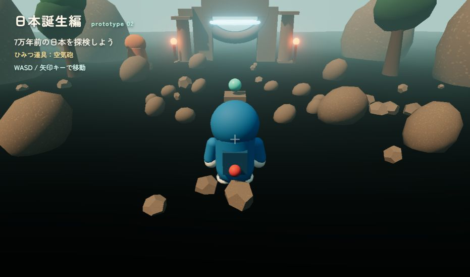

# 日本誕生編 prototype

Three.js + Vite + TypeScriptで作る、旧映画『のび太の日本誕生』をテーマにした3D冒険体験版です。



▶ [GitHub Pagesでプレイする](https://jim-auto.github.io/doraemon-game/)

## 遊び方

- WASD / 矢印キー：移動
- E：近くのスイッチに空気砲を使う
- スイッチを起動すると、遺跡の奥の扉が開きます

## 開発

```bash
npm install
npm run dev
```

本番ビルドの確認：

```bash
npm run build
npm run preview
```

## GitHub Pages

`main` または `master` ブランチへpushすると、`.github/workflows/deploy.yml`がビルドしてGitHub Pagesへ公開します。

GitHubリポジトリの Settings → Pages → Build and deployment で、Sourceを「GitHub Actions」に設定してください。

## 3D素材

遺跡の入口・柱・宝箱・松明には、QuaterniusのModular Dungeon packを使用しています。CC0 / Public Domainです。ライセンス情報は`public/models/dungeon/LICENSE-AND-ATTRIBUTION.txt`に記載しています。
